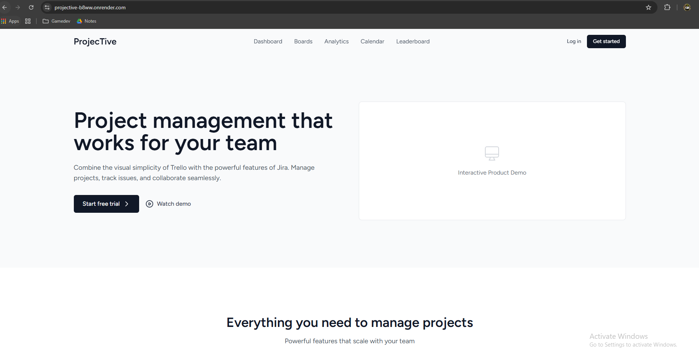
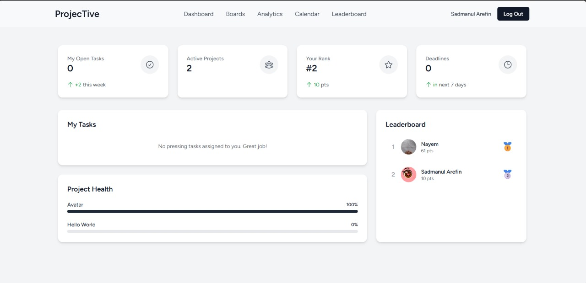
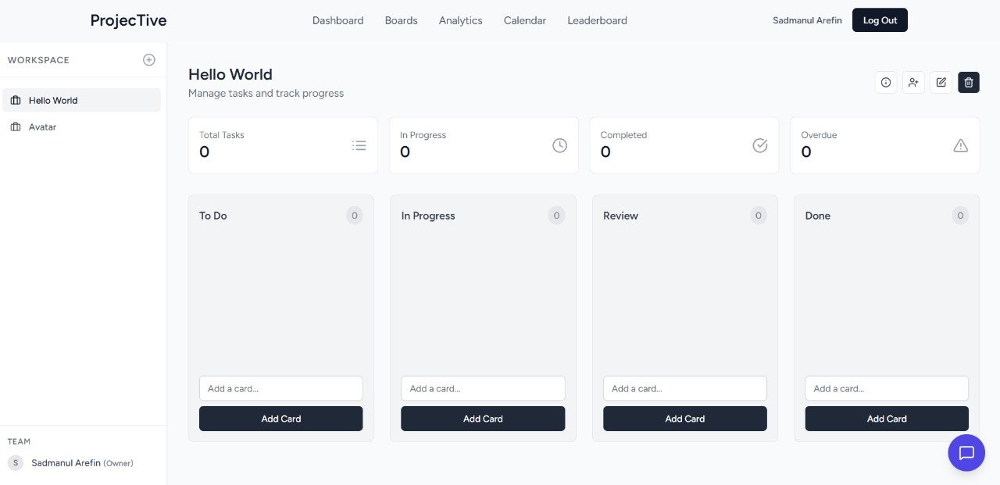
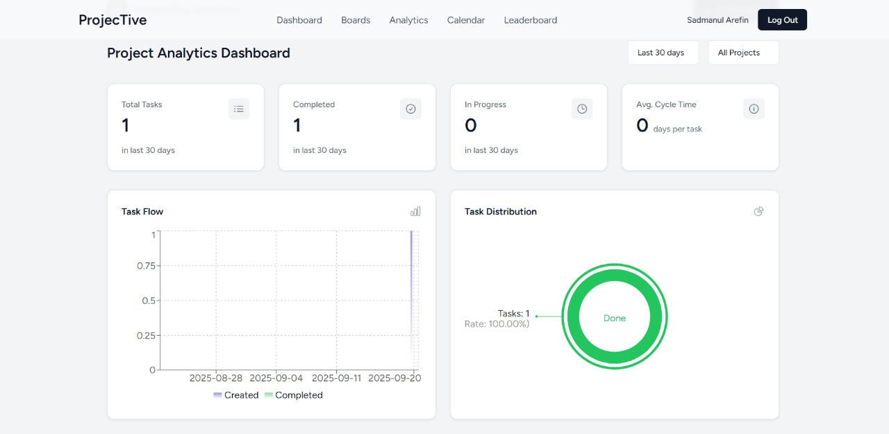
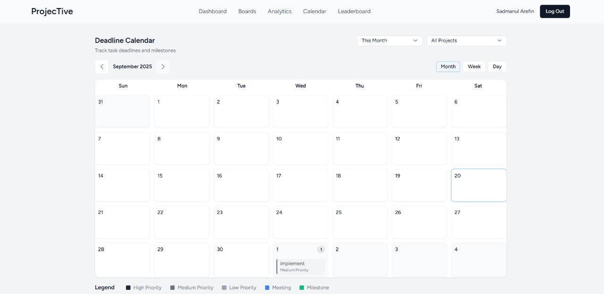
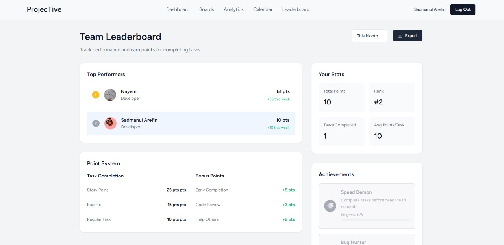

# Project Title

**Team Members:**

- Pabak Dev | pabak.cse.20220204005@aust.edu
- Jannatul Nayem | jannatul.cse.20220204007@aust.edu
- Sadmanul Arefin | sadmanul.cse.20220204009@aust.edu
- Israt Jahan Eshita | israt.cse.20220204018@aust.edu

**Project Live Link:** https://projective-b8ww.onrender.com/ \
**Recorded video:**

---

## Table of Contents

1. [Project Description](#1-project-description)
2. [Workflow Overview](#2-workflow-overview)
3. [Main Features](#3-main-features)
4. [Technologies Used](#4-technologies-used)
5. [System Architecture](#5-system-architecture)
6. [Setup Guidelines](#6-setup-guidelines)
   - [Backend](#backend)
   - [Frontend](#frontend)
7. [Running the Application](#7-running-the-application)
8. [Deployment Status & Tests](#8-deployment-status--tests)
9. [Contribution Table](#9-contribution-table)
10. [Screenshots](#10-screenshots)
11. [Limitations / Known Issues](#11-limitations--known-issues)

---

## 1. Project Description

**Projective** is a team-oriented task management platform designed to solve inefficiencies in team collaboration and communication within office environments. By offering centralized task tracking, gamified incentives, and real-time communication, the platform enhances productivity and motivation. The target audience includes office managers, team leaders, and small to medium-sized businesses seeking an affordable and intelligent task management tool.

---

## 2. Workflow Overview

The project workflow is centered around a Kanban-style board where managers can create projects and assign tasks to team members. Tasks move through a predefined status flow: To Do, In Progress, Review, and Complete. Team members can update task statuses, add comments for focused updates, and participate in task based discussions. A gamified system awards points for task completion, and a leaderboard tracks high-performing members to encourage healthy competition.

---

## 3. Main Features

- **Kanban Board View:** Manage tasks efficiently across different categories.
- **AI-Powered Chat Assistant:** Assist users with task assignments, project updates, and FAQs.
- **Deadline Calendar View:** View all tasks and deadlines within a calendar.
- **Points and Leaderboards:** Encourage healthy competition among employees.
- **Project Management:** Create new projects and assign employees and team members.
- **Task Management:** Customizable fields for deadlines, priority, and assignees.
- **User Roles & Permissions:** Differentiated access for Managers and Team Members.
- **Communication & Collaboration:** Real-time chat and task-specific comment threads.

---

## 4. Technologies Used

- **Frontend:** React with Vite, Tailwind CSS
- **Backend:** Laravel
- **Database:** MySQL
- **Rendering Method:** Client-Side Rendering (CSR)

---

## 5. System Architecture

The system architecture consists of a **React frontend** built with Vite, which communicates with a **Laravel backend**. The backend handles business logic, user authentication, and data processing. An **SQL database** is used for real-time data storage and scalability, which is ideal for the platform's collaborative features. The frontend utilizes **Client-Side Rendering (CSR)** for a fast and modular user experience.

---

## 6. Setup Guidelines

### Backend

```bash
# Clone the repository
git clone https://github.com/pabak-dev/Projective.git
cd projective-app

# Install dependencies
composer install

# Setup environment variables
cp .env.example .env
# Edit .env as needed

# Generate App Key
php artisan key:generate

# Migrate & Seed Database
php artisan migrate
php artisan db:seed

# Run backend server
php artisan migrate
```

```bash
# Incase of certains directories not being found
cd storage/framework
mkdir sessions
mkdir views
mkdir cache
```

### Frontend

```bash
cd projective-app

# Install dependencies
npm install

# Run frontend
npm run dev
```

---

## 7. Running the Application

```bash
cd projective-app

php artisan serve
```

or visit https://projective-b8ww.onrender.com/

## 8. Deployment Status & Tests

| Component | Is Deployed? | Is Dockerized? | Unit Tests Added? (Optional) | Is AI feature implemented? (Optional) |
| --------- | ------------ | -------------- | ---------------------------- | ------------------------------------- |
| Backend   | Yes          | Yes            | No                           | Yes                                   |
| Frontend  | Yes          | Yes            | No                           | Yes                                   |

_Note: Replace the placeholders with actual data. The optional features are nice to have but not mandatory but will be counted as bonus points if implemented properly._

## 9. Contribution Table

| Metric                        | Total | Backend | Frontend | Pabak Dev                                                                                                                                                                                                                                               | Jannatul Nayem                                                                                                                                                                                                                                          | Sadmanul Arefin                                                                                                                                                                                                                                         | Israt Jahan Eshita                                                                               |
| ----------------------------- | ----- | ------- | -------- | ------------------------------------------------------------------------------------------------------------------------------------------------------------------------------------------------------------------------------------------------------- | ------------------------------------------------------------------------------------------------------------------------------------------------------------------------------------------------------------------------------------------------------- | ------------------------------------------------------------------------------------------------------------------------------------------------------------------------------------------------------------------------------------------------------- | ------------------------------------------------------------------------------------------------ |
| Issues Solved                 | 33    | 15      | 18       | 12                                                                                                                                                                                                                                                      | 4                                                                                                                                                                                                                                                       | 10                                                                                                                                                                                                                                                      | 7                                                                                                |
| WakaTime Contribution (Hours) |       |         |          | 32 hrs 20 mins[](https://wakatime.com/badge/user/85cb73f7-78ac-4c44-b46a-96c2cea7248b/project/93bba6a0-7fdf-4749-a6c7-507d3a376ce8) | 8 hrs 42 mins[](https://wakatime.com/badge/user/a0bdd3d2-b1db-4c31-b28d-4fb8fae51ec4/project/6dfcc794-af19-4cdc-8f26-239e3214a707) | 21 hrs 32 mins[](https://wakatime.com/badge/user/5212e80f-0d42-46a3-8786-63be3a5dc3f8/project/d090dcde-0479-4a07-b8a8-a4f2cc688ee6) | [24 hrs 44 mins](https://wakatime.com/@ef2bed71-e8a7-48e8-bb38-ab2aa2859f61/projects/whjxdwgqmy) |
| Percent Contribution (%)      |       |         |          | 37%                                                                                                                                                                                                                                                     | 10%                                                                                                                                                                                                                                                     | 25%                                                                                                                                                                                                                                                     | 28%                                                                                              |

## 10. Screenshots







## 11. Limitations / Known Issues

We faced much difficulty trying to deploy the application. Deployment was being done succesfully but the appy was showing 500-Server Error without any stacktrace whatsoever. It took 3 days to get right, through trial and error of the dockerization.

As the app uses a free Gemini API key, prompt quotas are very limited and should be used sparingly.

Under poor internet connection, the app tends to operate slowly.
